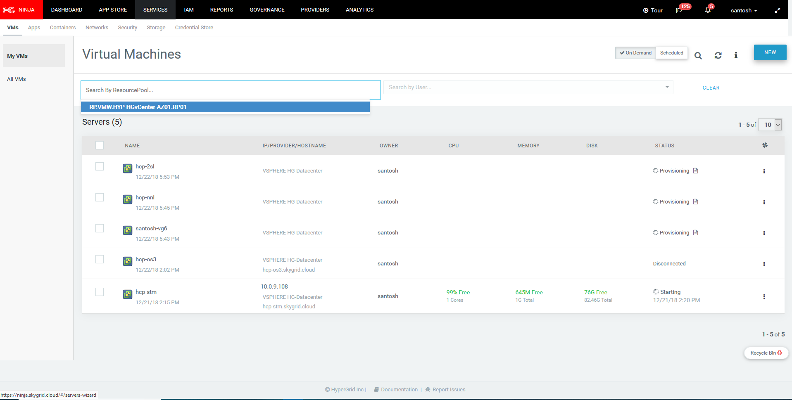
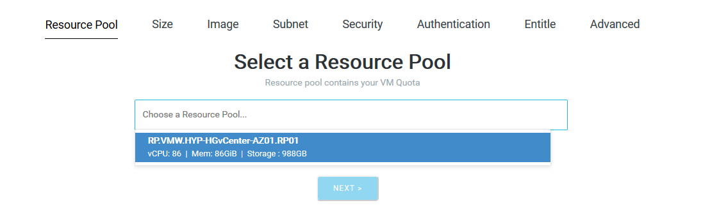
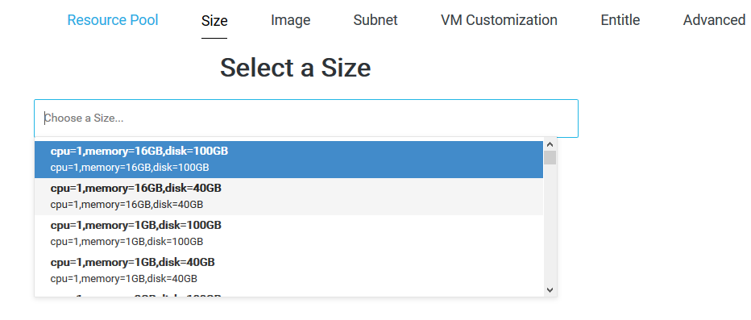
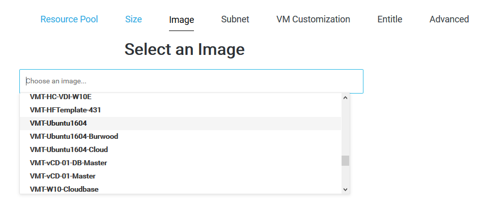
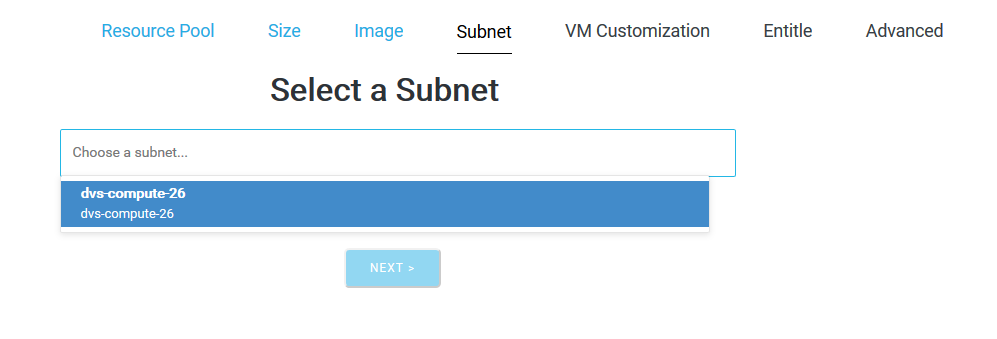
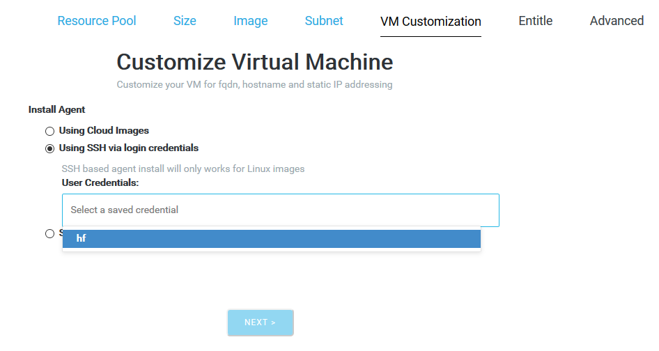
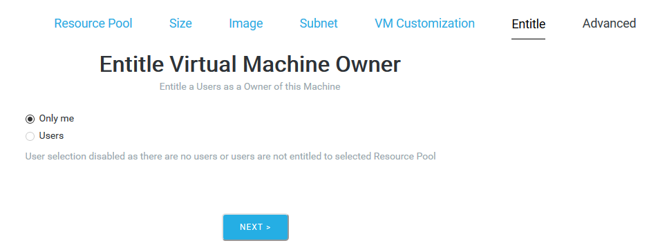
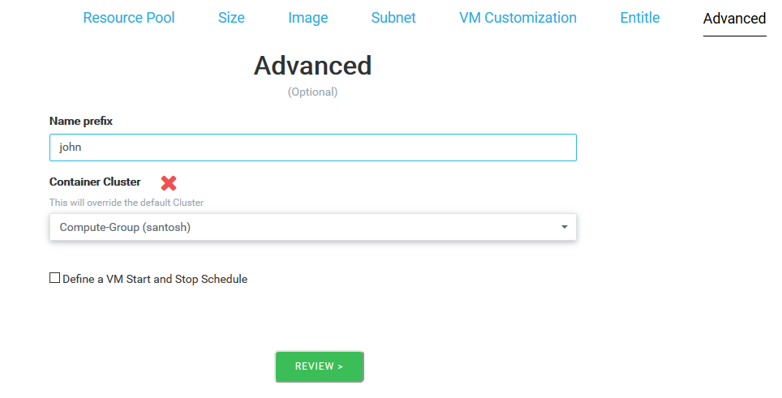
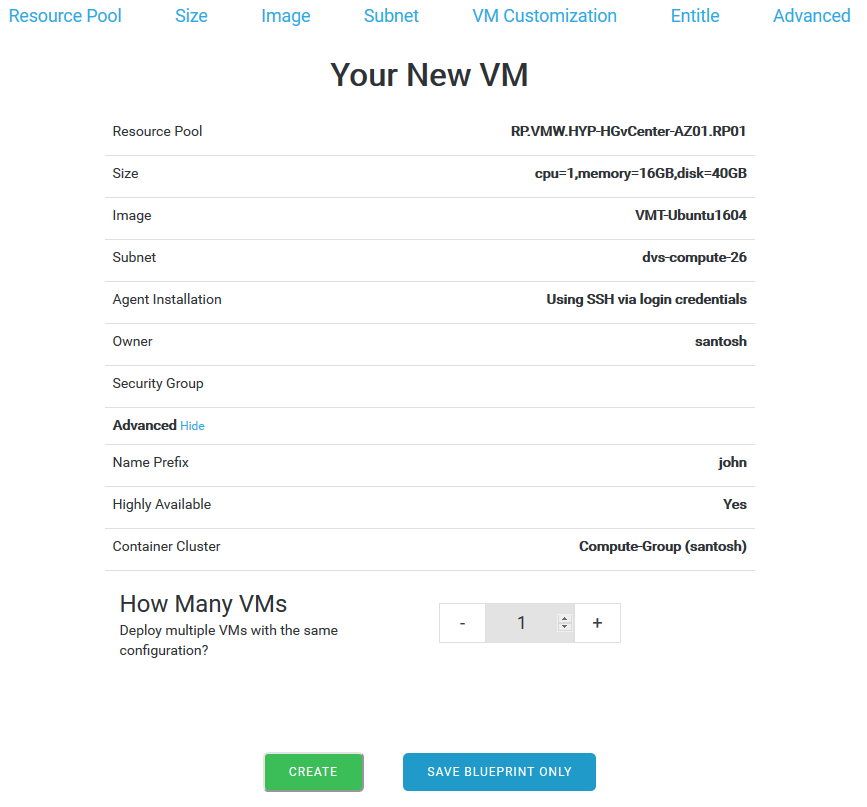

# HyperGrid Procedure For Creating a Blueprint
## For HyperCloud Portal

This page provides a step by step walk through on how to use the HyperGrid wizard for creating a VM Blueprint.

1. After you login you are presented with a set of menus. Click on the **Services** menu to see the list of running VMs. 
2. Press the button **new** on the right of the screen

3. Once you press **New** , you are presented with a *wizard* that lets you configure the below parameters for the VM to be created:

Parameter  | Description
---- | ----
Resource Pool  | This is already preacreated and should be allocated to you for choosing. 
Size | Provisioning applications and VMs through the API
Image | hkjhkh
Subnet | jlkjljl
Security | jkgjgjk
Authentication | jhgjhghjg
Entitle | jkgjhgjhg
Advanced | jhgjhgjhgjh

Choose from a list of provided preset configurations

