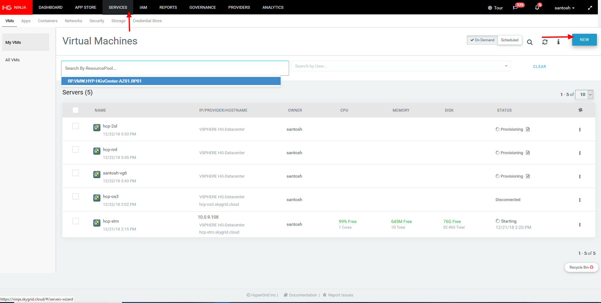

# HyperGrid Procedure For Creating a Blueprint
## For HyperCloud Portal

This page provides a step by step walk through on how to use the HyperGrid wizard for creating a VM Blueprint.

1. After you login you are presented with a set of menus. Click on the *Services* menu to see the list of running menus. 
2. Press the button *new* on the right of the screen

3. Once you press *New* , you are presented with a *wizard* that lets you configure the below parameters for the VM to be created: 

* Resource Pool
* Size Provisioning applications and VMs through the API
* Image
* Subnet 
* Security 
* Authentication
* Entitle
* Advanced

